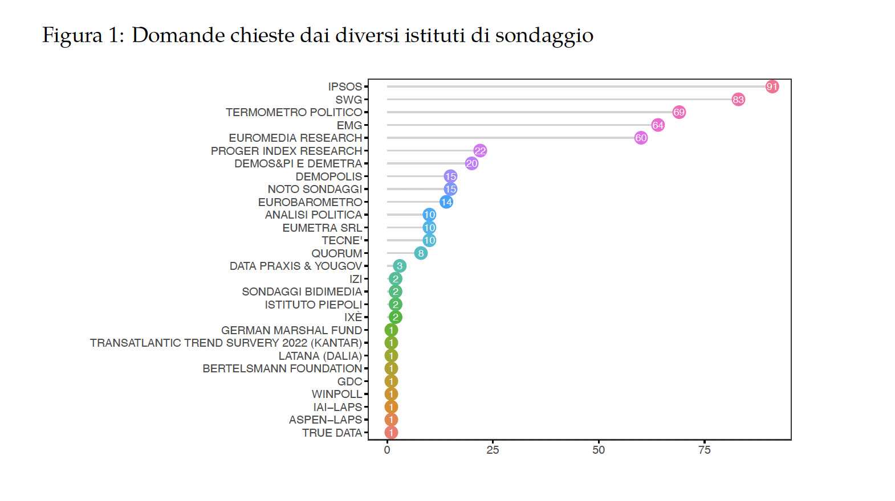
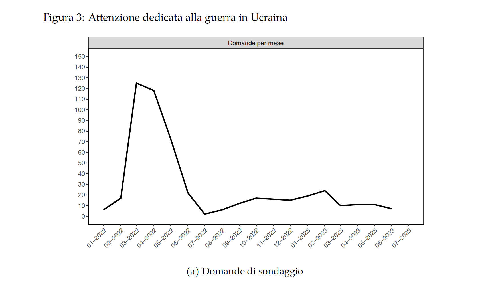
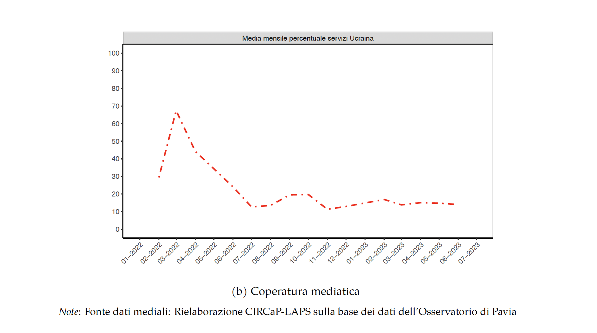

# INTRODUZIONE

## La guerra e l’opinione pubblica italiana

Nel tentativo di offrire agli studiosi, ai commentatori, ai giornalisti e al pubblico un quadro articolato e preciso della natura degli atteggiamenti dell’opinione pubblica italiana nei confronti della guerra in Ucraina nel tempo, abbiamo raccolto le distribuzioni di frequenza delle risposte a tutte le domande poste dai sondaggi condotti in Italia sul tema tra il febbraio 2022 e il giugno 2023 che siamo riusciti a rintracciare attingendo a fonti disponibili pubblicamente. Durante questo periodo sono state condotte in Italia decine di indagini nelle quali sono state poste centinaia di domande, dirette a sondare
gli atteggiamenti degli italiani sui più svariati aspetti della guerra in Ucraina.

La convinzione che motiva questa raccolta è che su tematiche controverse come appunto quella in oggetto, accanto ad analisi multivariate delle determinanti individuali degli atteggiamenti, sia particolarmente utile una valutazione aggregata delle opinioni del pubblico. Guardare alla foresta delle domande disponibili, piuttosto che al singolo albero che di essa fa parte, consente di analizzare l’opinione pubblica in maniera più sistematica e sfaccettata, evidenziando la complessita` delle opinioni e cogliendo possibili evoluzioni nel tempo.

Inoltre, il diverso modo di formulare le domande, frutto degli interessi spesso congiunturali dell’istituto di sondaggio o del committente della ricerca, consente di esplorare con qualche profondità le ragioni alla base degli atteggiamenti degli italiani. Come vedremo, la comparazione tra domande offerte con formulazioni diverse mostra l’importanza che il formato ed il contenuto delle domande hanno su tematiche complesse, caratterizzate da ampi margini di incertezza, nelle quali l’effetto di *framing* esercita una influenza nell’orientare le risposte degli intervistati. Il problema del cosiddetto question *wording*, lungi dall’essere un fattore di disturbo, una dimostrazione del fatto che con i sondaggi “si può far dire di tutto alla gente,” costituisce invece una risorsa preziosa per interpretare cosa abbiano in mente gli intervistati quando rispondono ad una domanda e quali argomenti possono indurli a orientare le loro risposte in una direzione piuttosto che l’altra [@Sudman-Bradburn1974].

Contrariamente a quanto avvenuto in altri Paesi [per esempio nel caso della Germania,
si veda @Mader-Schoen], solo pochi studi esplorano l’opinione pubblica italiana
sulla guerra. @Bordignon-Diamanti-Turato riportano che la guerra ha contribuito a un calo
della polarizzazione destra-sinistra negli atteggiamenti verso la Russia subito dopo
l’inizio del conflitto. @Isernia-Martini hanno analizzato le determinanti degli
atteggiamenti verso le sanzioni e la spedizione di armi nel giugno 2022, mentre @Basile-Isernia-Martini hanno discusso le diverse posizioni dell’elettorato italiano sulla
guerra prima delle elezioni parlamentari del settembre 2022. Tuttavia, finora, non `e
stata pubblicata alcuna analisi sistematica e a lungo termine su ciò che gli italiani pensano dei diversi aspetti di questa guerra. Questo volume breve è un primo tentativo di
colmare questa mancanza.

## Il metodo e i dati raccolti

Per ottenere lo scopo prefissato, quello di analizzare come l’opinione italiana ha reagito
di fronte all’invasione su vasta scala dell’Ucraina da parte della Russia e all’escalation
del conflitto, sono state raccolte tutte le domande rese pubblicamente disponibili sul sito
[sondaggipoliticoelettorali.it](http://www.sondaggipoliticoelettorali.it/) e sui
siti dei principali istituti di sondaggio (segnatamente IPSOS,EMGed SWGcon il bollettino
settimanale Radar). Nel complesso sono state individuate 931 domande, 511 delle
quali (il 54,9%) sono state poste una sola volta nel periodo considerato, mentre le altre
420 sono state poste almeno due volte nel tempo. Come riportato dalla figura 1, cinque
istituti (IPSOS, SWG, Termometro Politico, EMG e Euromedia Research) hanno posto
nel tempo più di due terzi delle domande complessive, mentre il resto `e stato chiesto
da 23 istituti diversi.

La raccolta sistematica di informazioni diretta a costruire questa raccolta di informazioni,
o *repository*, offre anche una idea sul modo in cui gli istituti di sondaggio italiani
affrontano temi pubblici di attualit`a che si prolungano nel tempo, come appunto la
guerra Ucraina. La figura 2 riporta quali sono state le aree tematiche coperte dalle 931
domande poste nel tempo, organizzate nel modo in cui sono discusse e presentate nel
volume Opinione Pubblica e Guerra in Ucraina accessibile online da questo *repository*.
Un terzo circa delle domande copre i temi collegati a cosa l’Italia, l’UE e la NATO
possono fare per aiutare l’Ucraina a resistere all’aggressione russa, mentre il 17% delle
domande sonda la valutazione che gli italiani danno dell’andamento del conflitto. E
circa lo stesso numero esplora le fonti delle preoccupazioni degli italiani per la guerra.
Attenzione molto minore è stata dedicata dagli istituti di sondaggio al ruolo dei media nel conflitto, un tema questo di qualche interesse per valutare la percezione del clima
di opinione delle persone, e alle cause della guerra.

La maggioranza degli istituti di sondaggio ha inoltre mostrato scarsa attenzione per
la continuità delle domande nel tempo, un aspetto, quello dell’analisi delle tendenze
dell’opinione pubblica a livello aggregato, particolarmente utile quando si tratta di
analizzare un fenomeno in evoluzione. I pochi trends disponibili sono stati realizzati
soprattutto grazie a IPSOS e, in misura minore, a EMG, mentre molto più discontinua
e ad hoc è stata la produzione di dati da parte di altri istituti che pur hanno dedicato a
questa tematica qualche risorsa, come SWG.

Inoltre, l’attenzione per questo tema è scemata nel corso del tempo. Lo testimonia ad
esempio il fatto che IPSOS, l’istituto che insieme a SWG e EMG, ha monitorato con più
sistematicità le opinioni degli italiani sul conflitto, ha progressivamente rarefatto le rilevazioni del suo *tracking* sull’Ucraina, già dalla fine del 2022 e ora solo sporadicamente pone domande su questo tema. La figura 3 mostra l’andamento dell’attenzione dedicata dagli istituti di sondaggio (a) – misurata dal numero totale di domande poste nel
mese – comparandolo con l’andamento dell’attenzione dedicata al tema dell’Ucraina
dai notiziari televisivi in prime time dei tre principali canali televisivi (TG1, La7 e TG5) (b), misurata in percentuale del tempo dedicato all’Ucraina in media in ciascun notiziario nel corso del mese. Le due serie sono largamente sovrapponibili e mostrano, senza alcuna pretesa di stabilire un nesso di causalità, come i due andamenti siano largamente simili (e fortemente correlati, r di Pearson = 0.928). L’attenzione e la copertura demoscopica è stata massima allo scoppio del conflitto, per poi diminuire nel tempo e stabilizzarsi a partire dall’estate del 2022, con un leggero aumento dell’interesse nel periodo settembre-ottobre 2022, presumibilmente per effetto delle elezioni parlamentari
nazionali. A partire dal marzo 2023 questo interesse è ulteriormente calato, per collocarsi a poche domande per mese.

Va, infine, segnalato che la guerra russo-ucraina `e stata oggetto di una certa attenzione
comparata tra paesi, con diverse indagini condotte contemporaneamente in più paesi,
prevalentemente europei. Si segnalano qui in particolare le indagini Eurobarometro
(che ha inserito domande sull’Ucraina in diverse indagini nel corso del periodo coperto
da questo rapporto) e quelle di SWG (Euroskopia), YOUGOV, NATO e German Marshall Fund of the United States con il *Transatlantic Trend Survey*. In questo campo sono state però soprattutto le ricerche condotte in ambito accademico a fornire le informazioni
più sistematiche e approfondite, in particolare le rilevazioni EUOpinions, dell’Istituto Universitario Europeo, e quella del Volkswagen Project in dieci paesi europei. In questo *repository* sono riportate le domande di tutti i paesi in cui sono stato poste, a condizione che vi fosse inclusa anche l’Italia.

### Le tematiche coperte e la struttura del libro

Questo volume `e organizzato per aree tematiche, nello specifico:

1. le preoccupazioni per la guerra e i suoi effetti, sia in assoluto che rispetto ad altre
problematiche di politica interna;

2. le cause della guerra e le responsabilit`a per il suo scoppio, con riferimento anche
alla percezione della Russia e di Putin;

3. la guerra e il suo andamento. Questa sezione si sofferma su quattro ordini di temi;

    * le aspettative circa la sua durata e il suo possibile esito (chi vincerà?);
  
    * il rischio di escalation militare (ad esempio con il possibile ricorso alle armi
nucleari) e politica (ad es. con la estensione del conflitto ad altri paesi,
segnatamente quelli della NATO);

    * l’atteggiamento verso specifiche richieste da parte ucraina, come quella di
una *No-Fly-Zone* nel mese di marzo, o di armi pesanti a partire da aprile 2022;

    * le opinioni sulle condizioni che consentono di porre fine al conflitto nonché
le valutazioni di eventuali negoziati;

4. il ruolo del nostro paese nel conflitto, con particolare riferimento alla decisione
italiana di inviare armi, imporre sanzioni, aumentare le spese militari e, in via del
tutto ipotetica, sia contribuire direttamente con le nostre truppe ad interventi militari
multilaterali, sia valutare una possibile accessione dell’Ucraina alla NATO, all’Unione Europea e l’eventuale costituzione di un esercito unico europeo;

5. gli effetti del conflitto, con particolare riferimento agli effetti economici delle
sanzioni, quelli politici dei migranti e quelli relativi al sostegno per l’Unione
Europea;

6. la percezione del clima di opinione in relazione anche alla simpatia nutrita per
l’Ucraina e la Russia nonch´e i giudizi riservati nei confronti dei rispettivi leader;

7. Il ruolo dei media e la percezione su come i media forniscano notizie sull’Ucraina.

Ogni sezione è aperta da una breve sintesi dei principali risultati che emergono dai
dati disponibili. Ciascuna sezione discute prima alcuni aspetti metodologici relativi al
modo in cui sono formulate le domande e ai loro effetti sulle distribuzioni delle risposte,
seguite da una descrizione degli atteggiamenti e della loro evoluzione nel tempo e,
quando possibile, comparando le posizioni dell’opinione pubblica italiana a quella di
altri paesi. Alla fine di ciascuna sezione del volume online vi è un’appendice che rimanda
attraverso apposito link al repository github contenente tutti i dati e le tabelle di tutte
le domande poste su ciascuna tematica, con le distribuzioni di frequenza, il testo della
domanda in italiano, la numerosit`a campionaria e la fonte dei dati.
